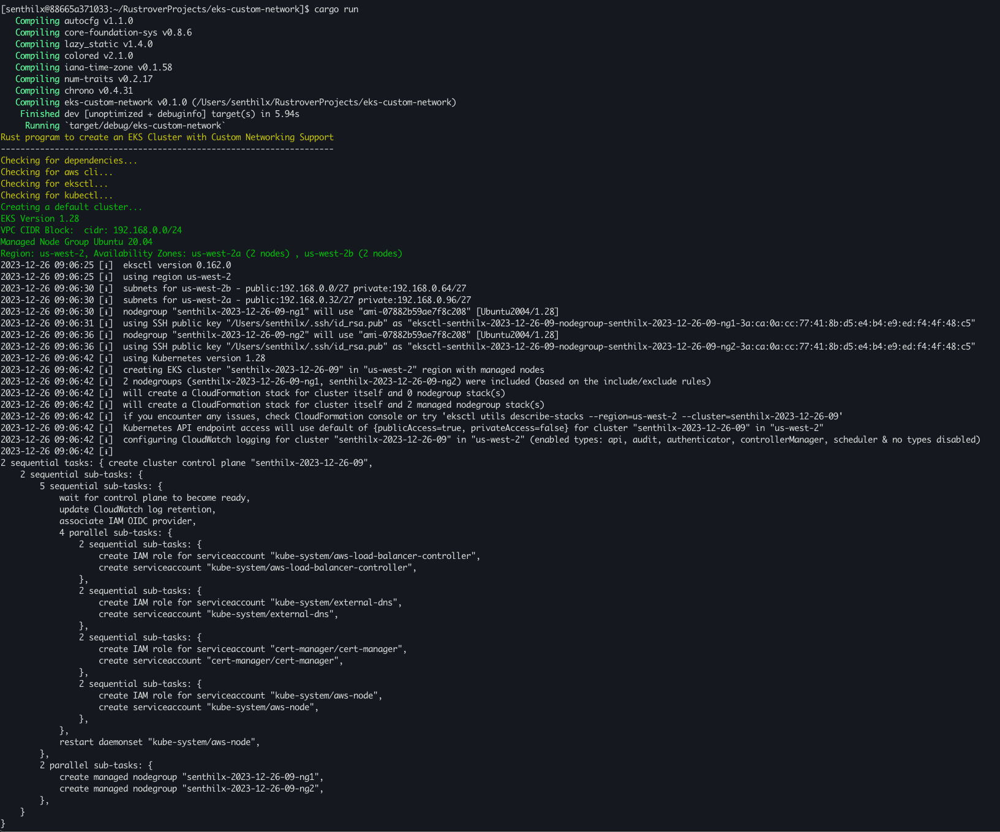
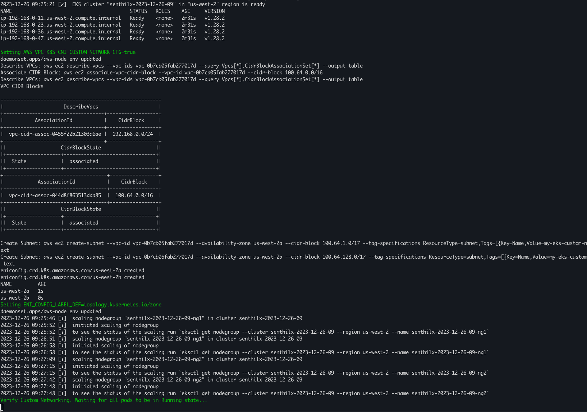
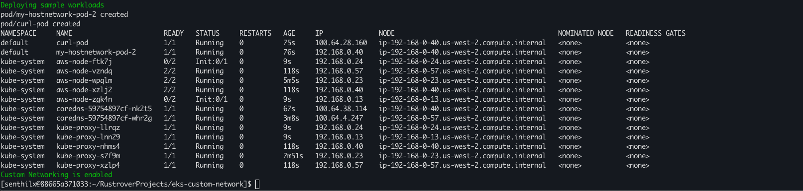

# EKS Cluster with Custom Networking

## Introduction

This is a tool for creating an EKS cluster with custom networking. This is based on
the [AWS documentation - Custom Networking for pods](https://docs.aws.amazon.com/eks/latest/userguide/cni-custom-network.html).

Unlike the documentation, for higher customization and convenience, this tool utilizes [eksctl](https://eksctl.io/) to
create the cluster, assign appropriate VPC CIDR, recycle
nodes and many cluster operation for convenience. It uses [AWS CLI](https://aws.amazon.com/cli/) to create the ENIConfig
custom resources.

## Prerequisites

* [AWS CLI](https://docs.aws.amazon.com/cli/latest/userguide/cli-chap-install.html)
* [eksctl](https://docs.aws.amazon.com/eks/latest/userguide/getting-started-eksctl.html)
* [kubectl](https://docs.aws.amazon.com/eks/latest/userguide/install-kubectl.html)

## Custom Networking

In EKS Clusters, the [vpc cni plugin](https://github.com/aws/amazon-vpc-cni-k8s/) will assign pods an ip address
selected from the primary subnet.

The primary subnet is the subnet CIDR that the primary ENI is attached to, one that is associated with VPC by default
during cluster create operation.
The maximum number of Pods you can run on a node is determined by the number of IP addresses available in the primary
subnet.

In Custom Networking, we enable to VPC CNI to assign Pods an IP address from a secondary subnet. This allows you to run
more Pods on a node. Custom networking support supports ENIConfig custom resource. The ENIConfig includes an alternate subnet
CIDR range (carved from a secondary VPC CIDR), along with the security group(s) that the Pods will belong to. When
custom networking is enabled, the VPC CNI creates secondary ENIs in the subnet defined under ENIConfig. The CNI assigns
Pods an IP addresses from a CIDR range defined in a ENIConfig CRD.

This tool will create a cluster with custom networking enabled. It will create two subnets in two different AZs. It will
create two ENIConfig custom resources, one for each subnet. It will then recycle the nodes to enable custom networking.

### Screenshots

